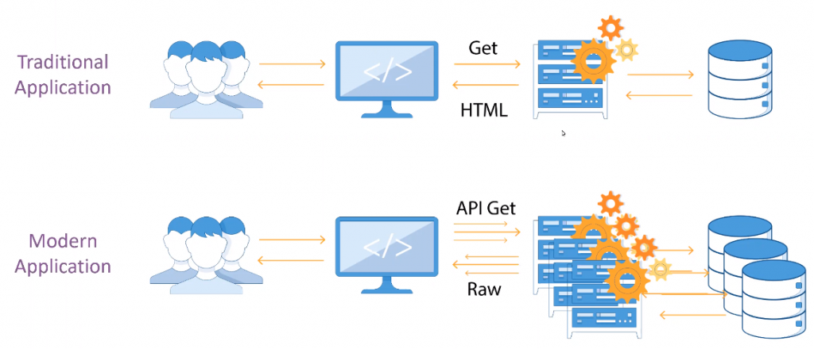

# What is API ?

##### Notes:

- 83% of all web traffic is now API call traffic (state of internet, 2018).
- Exposed APIs forms a larger surface area for attacks than the UI  in 90% of web enabled applications.
- Now, In 2022 the APIs become the first attack vector.

##### Traditional VS. Modern application 

#### OWASP API security top 10:
1) ##### Broken level object authorization **(IDOR)**
    - ###### It's all about an authenticated user performing unauthorized actions (Not planned to do so).
    - ###### How to prevent?
        - Never make user identifier (such as id) easy guessable (predictable) as user phone number, birth, etc... Try to make it unique and hard to be guessed.
        - Use an authorization mechanism to check if the logged-in user has access to perform the requested action on the record in every function that uses an input from the client to access a record in the database.
        - Don't rely on the identifier given by user (as it could be changeable), use identifier stored in the session object.
2) ##### Broken user authentication
    - ###### Impact:
        - Business impact:
        Attackers can gain control to other users’ accounts in the system, read their personal data, and perform sensitive actions on their behalf, like money transactions and sending personal messages.
    - ###### API is vulnerable if:
        - Permits attackers to perform a brute force attacks on the same user account, without presenting captcha/ account lockout mechanism.
        - Permits weak passwords.
        - Sends sensitive authentication details, such as auth tokens and passwords in the URL (publicly accessible).
        - Doesn't validate tokens well:
            - Accepts unsigned or even weakly signed JWT tokens ("alg":"none").
            - Doesn't check for their expiration date.
        - Uses plain text, non-encrypted, or even weakly hashed passwords.
        - Uses weak/ default encryption keys (secrets).
    - ###### How to prevent?
        - Credential recovery/ forget password endpoints should be protected endpoints (treated as logged in endpoints) in terms of brute force, rate limiting, and lockout protections.
        - Implement multi-factor authentication (MFA) or at least 2FA.
        - Implement anti brute force mechanisms **(This mechanism should be stricter than the regular rate limiting mechanism on your API)** to mitigate (decrease):
            - Brute force attacks.
            - Credential stuffing (Brute force by using leaked credentials)
            - Dictionary attacks (Type of brute force, but it's custom, made within conditions).
            - Credential enumerations (Type of brute force, ubt it's for known certain credential are used in this system or not).
        - Implement weak password checks.
        - Implement captcha mechanism or even account lockout to prevent brute force against certain account.
        - API keys should't be used for user authentication, [Check this to know the difference](https://cloud.google.com/endpoints/docs/openapi/when-why-api-key)
3) ##### Excessive data exposure
4) ##### Lack of resources and rate limiting
5) ##### Broken function level authorization
6) ##### Mass assignment
7) ##### Security misconfiguration
8) ##### Injection
9) ##### Insufficient logging and monitoring